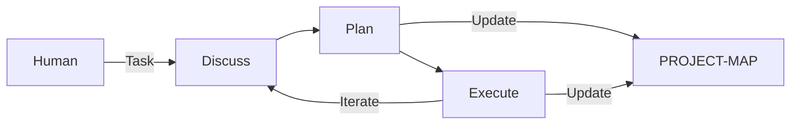

# jm-forge

**A framework for structured Agent Workflow — 让 Agent 工作流可追溯、可迭代、可自举**

---

## Getting Started / 快速上手

The primary installation path is: copy the official prompt and let your Agent bootstrap jm-forge end-to-end.
推荐的安装主路径是：复制官方提示词，让您的 Agent 端到端自举安装 jm-forge。

**Copy and paste the following prompt to your Agent:**
**复制并粘贴以下提示词给您的 Agent：**

```text
Install jm-forge skills for my current workspace.

Steps:
1. Clone https://github.com/jiya-mira/jm-forge into a temporary directory.
2. Copy all skill folders starting with `jmf-` from `skills/` into my local Agent skill directory
   (for example: `.gemini/skills/`, `.claude/skills/`, or `.opencode/skills/`).
3. Keep existing local files unless replacement is required for installation consistency.
4. After installation, update `AGENTS.md` in my workspace and add a short "jm-forge usage contract" section that includes:
   - workflow entry commands (`$jmf-new`, `$jmf-discuss`, `$jmf-plan`, `$jmf-execute`)
   - task state progression (`New -> Discussing -> Planning -> Pending -> Active -> Completed`)
   - task index path (`.workspace/tasks/INDEX.md`) as the task source of truth
5. Report what was installed and what was added/updated in `AGENTS.md`.
```

Recommended runtime data layout:
- `.workspace/tasks/` for task phase artifacts
- `.workspace/project-map/` for project map
- `.workspace/resource-map/` for resource inventory
- `.workspace/exp-map/` for experience records

Git strategy recommendation:
- Default suggestion: add `.workspace/` to `.gitignore`
- If your team needs to share these artifacts, you may choose to commit parts of `.workspace/`

### Installation Verification / 安装验证

Installation is considered successful only if the Agent can complete both checks:
仅当 Agent 能同时完成以下两项检查时，才视为安装成功：

1. Skills are installed and discoverable in the target skill directory.
   技能已安装到目标目录，且可被 Agent 正常发现。
2. `AGENTS.md` contains the required jm-forge usage contract entries.
   `AGENTS.md` 已写入要求的 jm-forge 使用约定条目。

If an Agent cannot complete these checks under explicit instructions, treat it as not yet suitable for the current jm-forge workflow baseline.
如果 Agent 在明确指令下仍无法完成上述检查，应视为暂不满足当前 jm-forge 工作流的基线要求。

---

## What is jm-forge? / 什么是 jm-forge？

jm-forge is a **methodology-first** framework for orchestrating AI agent workflows. It prevents context loss and state confusion by enforcing a structured cycle:
jm-forge 是一个**方法论优先**的 Agent 工作流编排框架。它通过强制执行结构化循环来防止上下文丢失和状态混乱：

```
Discuss → Plan → Execute → (repeat)
```

| Phase | Purpose / 目的 |
|-------|---------------|
| **Discuss** | Define goals, boundaries, and acceptance criteria / 定义目标、边界和验收标准 |
| **Plan** | Decompose tasks and set checkpoints / 分解任务并设置检查点 |
| **Execute** | Implement and verify / 执行并验证 |

---

## Core Concepts / 核心概念

### PROJECT-MAP / 项目地图

Instead of blindly scanning files, agents consult a structured map to understand the project instantly.
Agent 不再盲目扫描文件，而是查阅结构化地图以即时理解项目。

```
.workspace/project-map/
├── project.json       # Metadata / 元数据
├── domains.json       # Domain structure / 领域结构
└── SUMMARY.md        # Human-readable navigation / 导航指南
```

Use command: `jmf-init` (or `jmf-sync` to update).

### Self-Bootstrapping / 自举

The project structure is executable documentation. Each skill defines its own operating contract in `SKILL.md`, and installation should also leave a minimal jm-forge usage contract in `AGENTS.md`.
项目结构是可执行文档。每个技能在 `SKILL.md` 中定义自身操作约定，同时安装流程应在 `AGENTS.md` 中留下最小 jm-forge 使用约定。

---

## Development Environment / 开发环境

- **Agent:** Claude Code + MiniMAX-M2.7 (Reference implementation)
- **Tools:** uv, git

---

## Architecture & Theory / 架构与理论

Inspired by Herbert A. Simon's **Design Science** and the **OODA Loop**.



### Theoretical Foundations / 理论基石
- **Design Science:** Project structure as an artifact.
- **Problem Solving as Search:** Task decomposition (Newell & Simon).
- **Reflection-in-Action:** Discuss before acting (Schön).

---

## Compatibility / 兼容性

| Platform | Status | Path |
|----------|--------|------|
| **Gemini CLI** | ✅ Supported | `.gemini/skills/` |
| **Claude Code**| ✅ Primary | `.claude/skills/` |
| **OpenCode**   | ⚠️ Beta | `.opencode/skills/`|

The framework is **platform-independent**. It only requires an Agent capable of file I/O, shell execution, and following structured prompts.

---

## Contributing / 贡献

We welcome contributions via Issues. PRs are reviewed conservatively to maintain the self-bootstrapping integrity.
欢迎通过 Issue 提交贡献。为保持自举完整性，PR 审核将较为审慎。

*Last updated: 2026-03-27*
