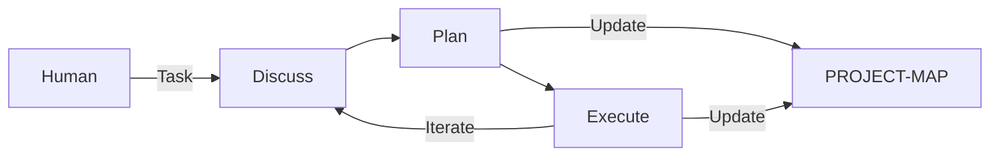

# jm-forge

**A framework for structured Agent Workflow — 让 Agent 工作流可追溯、可迭代、可自举**

---

## Getting Started / 快速上手

The simplest way to install jm-forge is to let your Agent **bootstrap itself**.
安装 jm-forge 最简单的方法是让您的 Agent **自我引导**。

**Copy and paste the following prompt to your Agent:**
**复制并粘贴以下提示词给您的 Agent：**

```text
Clone https://github.com/jiya-mira/jm-forge to a temporary directory.
Copy all folders starting with 'jmf-' from the 'skills/' directory into
my local workspace's skill directory (e.g., .gemini/skills/, .claude/skills/,
or .opencode/skills/). These are JMF Standard skills that use a 
Discuss→Plan→Execute workflow.
```

Recommended runtime data layout:
- `.workspace/tasks/` for task phase artifacts
- `.workspace/project-map/` for project map
- `.workspace/resource-map/` for resource inventory
- `.workspace/exp-map/` for experience records

Git strategy recommendation:
- Default suggestion: add `.workspace/` to `.gitignore`
- If your team needs to share these artifacts, you may choose to commit parts of `.workspace/`

### Installation Verification / 安装验证

If your Agent successfully executes this, it has passed the **Baseline Intelligence Test**. You can now use the framework.
如果您的 Agent 成功执行了此操作，说明它已通过**基准智能测试**。您现在可以使用该框架了。

---

## What is jm-forge? / 什么是 jm-forge？

jm-forge is a **methodology-first** framework for orchestrating AI agent workflows. It prevents context loss and state confusion by enforcing a structured cycle:
jm-forge 是一个**方法论优先**的 Agent 工作流编排框架。它通过强制执行结构化循环来防止上下文丢失和状态混乱：

```
Discuss → Plan → Execute → (repeat)
```

| Phase | Purpose / 目的 |
|-------|---------------|
| **Discuss** | Define goals, boundaries, and acceptance criteria / 定义目标、边界和验收标准 |
| **Plan** | Decompose tasks and set checkpoints / 分解任务并设置检查点 |
| **Execute** | Implement and verify / 执行并验证 |

---

## Core Concepts / 核心概念

### PROJECT-MAP / 项目地图

Instead of blindly scanning files, agents consult a structured map to understand the project instantly.
Agent 不再盲目扫描文件，而是查阅结构化地图以即时理解项目。

```
.workspace/project-map/
├── project.json       # Metadata / 元数据
├── domains.json       # Domain structure / 领域结构
└── SUMMARY.md        # Human-readable navigation / 导航指南
```

Use command: `jmf-init` (or `jmf-sync` to update).

### Self-Bootstrapping / 自举

The project structure itself is the documentation. Every skill is defined in a `SKILL.md` file that the Agent can read to understand how to use it.
项目结构本身即文档。每个技能都在 `SKILL.md` 中定义，Agent 可以通过阅读它来理解如何使用。

---

## Development Environment / 开发环境

- **Agent:** Claude Code + MiniMAX-M2.7 (Reference implementation)
- **Tools:** uv, git

---

## Architecture & Theory / 架构与理论

Inspired by Herbert A. Simon's **Design Science** and the **OODA Loop**.



### Theoretical Foundations / 理论基石
- **Design Science:** Project structure as an artifact.
- **Problem Solving as Search:** Task decomposition (Newell & Simon).
- **Reflection-in-Action:** Discuss before acting (Schön).

---

## Compatibility / 兼容性

| Platform | Status | Path |
|----------|--------|------|
| **Gemini CLI** | ✅ Supported | `.gemini/skills/` |
| **Claude Code**| ✅ Primary | `.claude/skills/` |
| **OpenCode**   | ⚠️ Beta | `.opencode/skills/`|

The framework is **platform-independent**. It only requires an Agent capable of file I/O, shell execution, and following structured prompts.

---

## Contributing / 贡献

We welcome contributions via Issues. PRs are reviewed conservatively to maintain the self-bootstrapping integrity.
欢迎通过 Issue 提交贡献。为保持自举完整性，PR 审核将较为审慎。

*Last updated: 2026-03-24*
