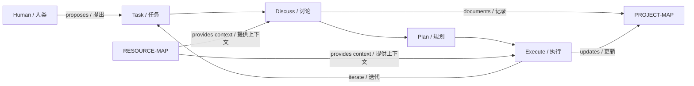

# jm-forge

**A framework for structured Agent Workflow — 让 Agent 工作流可追溯、可迭代、可自举**

---

## What is jm-forge? / 什么是 jm-forge？

jm-forge is a **methodology-first** framework for orchestrating AI agent workflows. It provides structure without constraining creativity, enabling agents to tackle complex, multi-phase projects with clarity and continuity.

jm-forge 是一个**方法论优先**的 Agent 工作流编排框架。它在不为创造力设限的前提下提供结构，使 Agent 能够清晰、连贯地处理复杂的多阶段项目。

---

## The Problem / 问题

AI agents excel at single tasks but struggle with:
- **Context loss** across sessions
- **State confusion** in multi-step workflows
- **Repetitive reinvention** of project structure

AI Agent 擅长单一任务，但在以下方面表现不足：
- 跨会话的**上下文丢失**
- 多步骤工作流中的**状态混乱**
- 项目结构的**重复摸索**

---

## Our Solution: Structured Workflow / 解决方案：结构化工作流

Inspired by Herbert A. Simon's **design science methodology** and the **OODA loop** (Observe-Orient-Decide-Act), jm-forge introduces a disciplined workflow:

```
Discuss → Plan → Execute → (repeat)
```

jm-forge 受 Herbert A. Simon 的**设计科学方法论**和 **OODA 循环**（观察-定向-决策-行动）启发，引入了纪律化的工作流：

```
讨论（Discuss）→ 规划（Plan）→ 执行（Execute）→ 循环
```

| Phase | 阶段 | Purpose / 目的 |
|-------|---|---------------|
| **Discuss** | 讨论 | Define goals, boundaries, assumptions, acceptance criteria / 定义目标、边界、假设、验收标准 |
| **Plan** | 规划 | Decompose into steps, verify checkpoints / 分解步骤，验证检查点 |
| **Execute** | 执行 | Implement with verification / 执行并验证 |

This is not rigid process — it's **structured reflection** that keeps both human and agent aligned.

这不是刚性流程，而是**结构化反思**，让人和 Agent 保持对齐。

---

## Key Concepts / 核心概念

### PROJECT-MAP / 项目地图

Every project gets a `PROJECT-MAP/` directory that serves as a navigable context map. Instead of blind scanning, agents can consult the map to understand project structure at a glance.

每个项目都有一个 `PROJECT-MAP/` 目录，作为可导航的上下文地图。Agent 无需盲目扫描，只需查阅地图即可快速了解项目结构。

```
PROJECT-MAP/
├── project.json       # Metadata / 元数据
├── domains.json       # Domain/module nodes / 领域/模块节点
├── entries.json       # Entry points / 入口点
├── assets.json        # Config, resources / 配置、资源
├── relationships.json # Typed edges / 类型化边
└── SUMMARY.md        # Human-readable navigation / 人类可读的导航
```

### RESOURCE-MAP / 资源地图

Beyond code structure, projects often involve **external resources**: servers, equipment, organizations, people, financial assets. `RESOURCE-MAP/` captures these:

除代码结构外，项目通常涉及**外部资源**：服务器、设备、组织、人员、财务资产。`RESOURCE-MAP/` 捕获这些信息：

```json
{
  "resources": [
    {
      "id": "prod-server",
      "category": "infrastructure",
      "name": "Production Server / 生产服务器",
      "controllable": true,
      "safety": { "level": "high-caution" },
      "attributes": { "host": "prod.example.com", "services": ["nginx", "redis"] }
    }
  ]
}
```

### Self-Bootstrapping / 自举

The framework **bootstraps itself**: every skill is documented in `SKILL.md`, and the project structure itself serves as documentation. An agent can read this repository and understand how to install and use the framework.

框架**自我引导**：每个 skill 都在 `SKILL.md` 中有文档，项目结构本身即文档。Agent 可以阅读此仓库，理解如何安装和使用框架。

---

## Theoretical Foundations / 理论基石

| Theory / 理论 | Source / 来源 | Application / 应用 |
|--------------|--------------|------------------|
| Design Science / 设计科学 | Herbert A. Simon, *Sciences of the Artificial* | Project structure as artificial artifact / 项目结构作为人工制品 |
| Problem Solving as Search / 问题求解即搜索 | Newell & Simon, *Human Problem Solving* | Task decomposition as search / 任务分解为搜索 |
| Reflection-in-Action / 行动中反思 | Donald Schön, *The Reflective Practitioner* | Discuss before acting / 行动前讨论 |
| Iterative Development / 迭代开发 | Kent Beck | Incremental improvement / 增量改进 |
| OODA Loop | John Boyd | Observe-Orient-Decide-Act cycle / 观察-定向-决策-行动循环 |
| Agent Architecture / Agent 架构 | Russell & Norvig, *AI: A Modern Approach* | Agent-environment interaction / Agent-环境交互 |

---

## Architecture / 架构



---

## Development Environment / 开发环境

Currently developed and tested with:
- **Claude Code** + **MiniMAX-M2.7** — Primary development and testing platform / 主要开发和测试平台
- **uv** — Python package manager / Python 包管理器
- **git** — Version control / 版本控制

当前开发和测试环境：
- **Claude Code** + **MiniMAX-M2.7** — 主要开发和测试平台
- **uv** — Python 包管理器
- **git** — 版本控制

---

## Cross-Agent Compatibility / 跨 Agent 兼容性

### Supported Agent Platforms / 支持的 Agent 平台

jm-forge is designed to work with any agent that can:
- Read and write files
- Execute shell commands
- Follow structured prompts

jm-forge 设计为与任何满足以下条件的 Agent 配合使用：
- 能读写文件
- 能执行 shell 命令
- 能遵循结构化提示词

### Tested Platforms / 已测试平台

| Platform | Status | Notes |
|----------|--------|-------|
| Claude Code | ✅ Primary | Actively used for development |
| MiniMAX-M2.7 | ✅ Tested | Primary testing platform |

### Recommended Models / 推荐模型

The framework requires sufficient reasoning capability. Recommended model baseline:

- **Claude series** ( Sonnet 4+ / Opus 4+ )
- **GPT series** ( GPT-4o / o1 and equivalent reasoning models )
- **Gemini series** ( with advanced reasoning capabilities )

Baseline requirement: The model must be capable of following structured prompts and maintaining context across multi-step workflows.

框架需要足够的推理能力。推荐模型基线：

- **Claude 系列** ( Sonnet 4+ / Opus 4+ )
- **GPT 系列** ( GPT-4o / o1 及同等推理能力模型 )
- **Gemini 系列** ( 具备高级推理能力 )

基线要求：模型必须能够遵循结构化提示词，并在多步骤工作流中保持上下文。

---

### Cross-Model Compatibility / 跨模型兼容性

The framework is **platform-independent** — it does not depend on any specific agent SDK or API. It relies only on file system access and shell execution, making it adaptable to any agent that provides these capabilities.

框架**平台无关**——不依赖任何特定的 Agent SDK 或 API。它仅依赖文件系统访问和 shell 执行，可适配任何提供这些能力的 Agent。

---

## Getting Started / 快速上手

The simplest way to install jm-forge is to let your Agent read the repository and install it itself:

最简单的安装方式是让 Agent 自己阅读仓库并自行安装：

```
Read this repository and install jm-forge following the workflow defined here.
阅读这个仓库，按照其中的工作流定义安装 jm-forge。
```

Or manually: / 或手动：

```bash
git clone https://github.com/jiya-mira/jm-forge.git
cd jm-forge
cat AGENTS.md
```

---

## Roadmap / 路线图

- [ ] Cross-agent resource sharing / 跨 Agent 资源共享
- [ ] Automated testing harness / 自动化测试工具
- [ ] Integration with more agent platforms / 更多 Agent 平台集成
- [ ] Plugin system for specialized workflows / 专用工作流插件系统
- [ ] Visualization tools for map navigation / 地图可视化工具

---

## Contributing / 贡献

We welcome all contributions — ideas, code, documentation, feedback. The framework is at an early stage and benefits from diverse perspectives.

我们欢迎各种形式的贡献——想法、代码、文档、反馈。框架处于早期阶段，多样化的视角有助于其发展。

**Non-code contributions especially welcome:** methodology discussions, use case reports, and theoretical critiques help shape the framework's direction.

**特别欢迎非代码贡献：** 方法论讨论，用例报告、理论批评都有助于塑造框架方向。

- Open an issue to propose changes / 开 issue 提议改进
- Start a discussion for exploratory topics / 发起讨论探索性话题
- Submit PRs for concrete improvements / 提交 PR 改进具体问题

---

*Last updated: 2026-03-23*
