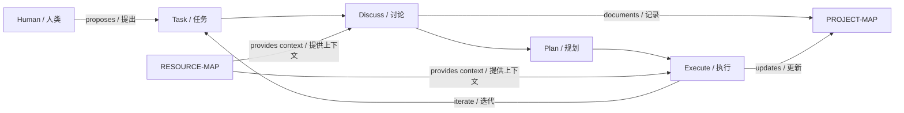

# jm-forge

**A framework for structured Agent Workflow — 让 Agent 工作流可追溯、可迭代、可自举**

---

## What is jm-forge? / 什么是 jm-forge？

jm-forge is a **methodology-first** framework for orchestrating AI agent workflows. It provides structure without constraining creativity, enabling agents to tackle complex, multi-phase projects with clarity and continuity.

jm-forge 是一个**方法论优先**的 Agent 工作流编排框架。它在不为创造力设限的前提下提供结构，使 Agent 能够清晰、连贯地处理复杂的多阶段项目。

---

## The Problem / 问题

AI agents excel at single tasks but struggle with:
- **Context loss** across sessions
- **State confusion** in multi-step workflows
- **Repetitive reinvention** of project structure

AI Agent 擅长单一任务，但在以下方面表现不足：
- 跨会话的**上下文丢失**
- 多步骤工作流中的**状态混乱**
- 项目结构的**重复摸索**

---

## Our Solution: Structured Workflow / 解决方案：结构化工作流

Inspired by Herbert A. Simon's **design science methodology** and the **OODA loop** (Observe-Orient-Decide-Act), jm-forge introduces a disciplined workflow:

```
Discuss → Plan → Execute → (repeat)
```

jm-forge 受 Herbert A. Simon 的**设计科学方法论**和 **OODA 循环**（观察-定向-决策-行动）启发，引入了纪律化的工作流：

```
讨论（Discuss）→ 规划（Plan）→ 执行（Execute）→ 循环
```

| Phase | 阶段 | Purpose / 目的 |
|-------|---|---------------|
| **Discuss** | 讨论 | Define goals, boundaries, assumptions, acceptance criteria / 定义目标、边界、假设、验收标准 |
| **Plan** | 规划 | Decompose into steps, verify checkpoints / 分解步骤，验证检查点 |
| **Execute** | 执行 | Implement with verification / 执行并验证 |

This is not rigid process — it's **structured reflection** that keeps both human and agent aligned.

这不是刚性流程，而是**结构化反思**，让人和 Agent 保持对齐。

---

## Key Concepts / 核心概念

### PROJECT-MAP / 项目地图

Every project gets a `PROJECT-MAP/` directory that serves as a navigable context map. Instead of blind scanning, agents can consult the map to understand project structure at a glance.

每个项目都有一个 `PROJECT-MAP/` 目录，作为可导航的上下文地图。Agent 无需盲目扫描，只需查阅地图即可快速了解项目结构。

```
PROJECT-MAP/
├── project.json       # Metadata / 元数据
├── domains.json       # Domain/module nodes / 领域/模块节点
├── entries.json       # Entry points / 入口点
├── assets.json        # Config, resources / 配置、资源
├── relationships.json # Typed edges / 类型化边
└── SUMMARY.md        # Human-readable navigation / 人类可读的导航
```

### RESOURCE-MAP / 资源地图

Beyond code structure, projects often involve **external resources**: servers, equipment, organizations, people, financial assets. `RESOURCE-MAP/` captures these as a project-local file (gitignored — not part of the framework distribution).

除代码结构外，项目通常涉及**外部资源**：服务器、设备、组织、人员、财务资产。`RESOURCE-MAP/` 将这些作为项目本地文件捕获（gitignored — 不属于框架发布的一部分）。

See `jm-forge:resource` skill for management commands.

管理命令见 `jm-forge:resource` skill。

### Self-Bootstrapping / 自举

The framework **bootstraps itself**: every skill is documented in `SKILL.md`, and the project structure itself serves as documentation. An agent can read this repository and understand how to install and use the framework.

框架**自我引导**：每个 skill 都在 `SKILL.md` 中有文档，项目结构本身即文档。Agent 可以阅读此仓库，理解如何安装和使用框架。

---

## Theoretical Foundations / 理论基石

| Theory / 理论 | Source / 来源 | Application / 应用 |
|--------------|--------------|------------------|
| Design Science / 设计科学 | [Simon, *Sciences of the Artificial*](https://en.wikipedia.org/wiki/Design_science) | Project structure as artificial artifact / 项目结构作为人工制品 |
| Problem Solving as Search / 问题求解即搜索 | [Newell & Simon, *Human Problem Solving*](https://en.wikipedia.org/wiki/Allen_Newell) | Task decomposition as search / 任务分解为搜索 |
| Reflection-in-Action / 行动中反思 | [Schön, *The Reflective Practitioner*](https://en.wikipedia.org/wiki/Donald_Sch%C3%B6n) | Discuss before acting / 行动前讨论 |
| Iterative Development / 迭代开发 | [Kent Beck](https://en.wikipedia.org/wiki/Iterative_and_incremental_development) | Incremental improvement / 增量改进 |
| OODA Loop | [Boyd, *OODA Loop*](https://en.wikipedia.org/wiki/OODA_loop) | Observe-Orient-Decide-Act cycle / 观察-定向-决策-行动循环 |
| Agent Architecture / Agent 架构 | [Russell & Norvig, *AI: A Modern Approach*](https://en.wikipedia.org/wiki/Intelligent_agent) | Agent-environment interaction / Agent-环境交互 |
| Wicked Problems / 棘手问题 | [Rittel & Webber](https://en.wikipedia.org/wiki/Wicked_problem) | Goals discovered through investigation, not defined in advance / 目标通过调查研究发现，而非预先定义 |
| Double Loop Learning / 双环学习 | [Argyris & Schön](https://en.wikipedia.org/wiki/Double-loop_learning) | Question assumptions, not just fix behavior / 质疑假设，而非仅修正行为 |

---

## Architecture / 架构



---

## Development Environment / 开发环境

**Agent:** Claude Code + MiniMAX-M2.7
**Tools:** uv, git

当前开发环境：
- **Agent：** Claude Code + MiniMAX-M2.7
- **工具：** uv, git

---

## Cross-Agent Compatibility / 跨 Agent 兼容性

### Supported Agent Platforms / 支持的 Agent 平台

jm-forge is designed to work with any agent that can:
- Read and write files
- Execute shell commands
- Follow structured prompts

jm-forge 设计为与任何满足以下条件的 Agent 配合使用：
- 能读写文件
- 能执行 shell 命令
- 能遵循结构化提示词

### Tested Platforms / 已测试平台

| Platform | Status | Notes |
|----------|--------|-------|
| Claude Code | ✅ Primary | Actively used for development |
| MiniMAX-M2.7 | ✅ Tested | Primary testing platform |

### Recommended Models / 推荐模型

The framework requires sufficient reasoning capability. Recommended model baseline:

- **Claude series**
- **GPT series**
- **Gemini series**

Baseline requirement: The model must be capable of following structured prompts and maintaining context across multi-step workflows.

框架需要足够的推理能力。推荐模型基线：

- **Claude 系列**
- **GPT 系列**
- **Gemini 系列**

基线要求：模型必须能够遵循结构化提示词，并在多步骤工作流中保持上下文。

### Baseline Models / 基线模型

The framework can also work with more limited models, though with reduced autonomy and more manual intervention:

- **MiniMax series** — Functional but requires more human guidance / 可用但需更多人工干预

基线模型也能运行框架，但自主性较低，需要更多人工介入：

- **MiniMax 系列** — 效果稍逊，需要更多人工指导

---

### Cross-Model Compatibility / 跨模型兼容性

The framework is **platform-independent** — it does not depend on any specific agent SDK or API. It relies only on file system access and shell execution, making it adaptable to any agent that provides these capabilities.

框架**平台无关**——不依赖任何特定的 Agent SDK 或 API。它仅依赖文件系统访问和 shell 执行，可适配任何提供这些能力的 Agent。

---

## Getting Started / 快速上手

The simplest way to install jm-forge is to let your Agent bootstrap itself. Give your agent this prompt:

```
Clone https://github.com/jiya-mira/jm-forge to a temporary directory,
run `uv run scripts/install-workspaces-skills.py` there, then copy the
installed skills to your workspace's platform skill directory.
```

---

## Roadmap / 路线图

- [ ] **Cross-agent resource sharing** — Enable agents to share and synchronize RESOURCE-MAP data across sessions or teams. / 跨 Agent 资源共享 — 使 Agent 能够在不同会话或团队间共享和同步 RESOURCE-MAP 数据。
- [ ] **Automated testing harness** — Create a validation framework to verify skills work correctly across environments. / 自动化测试工具 — 创建验证框架，确保技能在不同环境下正确工作。
- [ ] **Integration with more agent platforms** — Adapt jm-forge skills to work with additional agent runtimes beyond Claude Code. / 更多 Agent 平台集成 — 使 jm-forge skills 适应更多 Agent 运行时。
- [ ] **Plugin system for specialized workflows** — Allow domain-specific workflow extensions beyond the core D→P→E loop. / 专用工作流插件系统 — 在核心 D→P→E 循环之外允许特定领域的工作流扩展。
- [ ] **Visualization tools for map navigation** — Build UI tools for browsing PROJECT-MAP and RESOURCE-MAP more intuitively. / 地图可视化工具 — 构建 UI 工具，更直观地浏览 PROJECT-MAP 和 RESOURCE-MAP。

---

## Contributing / 贡献

We welcome all contributions — any Agent, human, or system can open an issue. All useful information is welcome: methodology discussions, use case reports, theoretical critiques, evaluation results, and bug reports.

我们欢迎各种形式的贡献——任何 Agent、人类或系统都可以开 issue。所有有用的信息都欢迎：方法论讨论、用例报告、理论批评、测评结果、bug 报告。

**PRs are handled judiciously** — As a self-bootstrapping framework, we are conservative about merging external contributions. Issues are preferred for collaboration; PRs will be reviewed carefully before acceptance.

**我们会慎重处理 PR** —— 作为一个自举框架，我们对合并外部贡献持保守态度。推荐通过 issue 协作；PR 会在仔细审核后再接受。

- Open an issue for any contribution / 开 issue 提交任何形式的贡献
- Start a discussion for exploratory topics / 发起讨论探索性话题
- Submit PRs for concrete improvements (reviewed carefully) / 提交 PR 改进具体问题（会慎重审核）

### Credit / 署名

Contributors whose ideas, reports, or critiques are adopted will be credited in the relevant documentation. jm-forge embraces transparent acknowledgment — all meaningful contributions will be recognized.

被采纳的有价值贡献将在相关文档中获得署名。jm-forge 重视透明的致谢——所有有意义的贡献都将被认可。

*(Future: Automated credit workflow via jm-forge issues integration — the framework's own workflow can process and attribute contributions automatically.)*

*(未来：通过 jm-forge issue 集成实现自动署名工作流——框架自身的工作流可以自动处理和归因贡献。)*

---

*Last updated: 2026-03-24*
